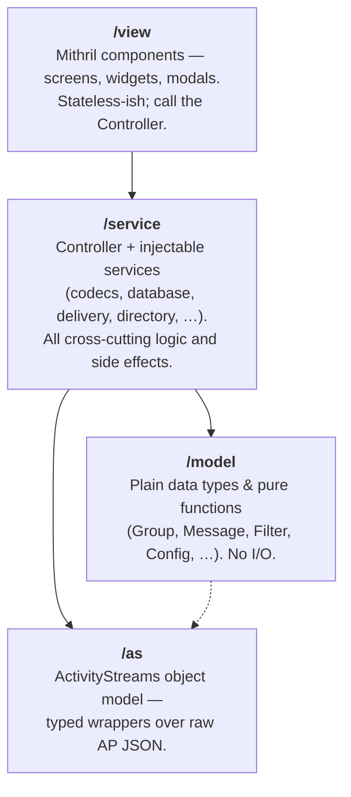

# Conversations (MLS) — Application Architecture

This is the **client application** for `conversations-mls`, the end-to-end encrypted
messenger for [Emissary](https://emissary.dev). It implements the
[Messaging Layer Security in ActivityPub](https://swicg.github.io/activitypub-e2ee/mls)
specification — MLS ([RFC 9420](https://datatracker.ietf.org/doc/rfc9420/)) carried over
ActivityPub.

> **Where things live.** The package is an Emissary template (`user-conversations/`). The
> single-page app lives in `user-conversations/resources/app/`. App source is under `src/`,
> the bundle is emitted to `dist/app.js`, and the template (`user-conversations/template.hjson`,
> `index.html`, `stylesheet/`) wraps it. Everything below refers to paths under `src/`.

---

## 1. About This App

This is a browser-only "single page application" that runs **inside an Emissary actor's page**. 

It supports two kinds of conversation side-by-side, each of which is abstracted behind a common `ICodec` interface so the rest of the app is largely codec-agnostic. The two types are:

- **PLAINTEXT** — ordinary ActivityPub direct messages, which is compatible with other servers like Mastodon, for recipients who don't support MLS.
- **MLS** — end-to-end encrypted groups (RFC 9420).

For encrypted conversations, this app does all MLS
cryptography client-side; the server never sees plaintext or private keys. It speaks to the
Emissary host purely through the [ActivityPub API](https://www.w3.org/TR/activitypub/#client-to-server-interactions) (the actor's outbox, a proxy endpoint,
and a server-sent-events / polling feed). MLS group state and message history are persisted
**only on the device**, in an encrypted IndexedDB database.


---

## 2. Tech Stack

| Concern        | Tool                                                                |
| -------------- | ------------------------------------------------------------------- |
| UI framework   | **[Mithril 2](https://mithril.js.org/)** (with JSX via esbuild's `--jsx-factory`) |
| Reactivity     | `mithril/stream` for observable values; `m.redraw()` for repaint    |
| MLS            | [`ts-mls`](https://github.com/LukaJCB/ts-mls) (v2 RC)               |
| Crypto         | `@noble/curves`, `@noble/hashes`, WebCrypto (`crypto.subtle`)       |
| Local storage  | **IndexedDB** via `idb`, encrypted with an AES key                  |
| Sanitization   | `dompurify`                                                         |
| Build          | [`esbuild`](https://esbuild.github.io/) (`npm start` = watch build to `dist/`) |
| Tests          | [`vitest`](https://vitest.dev/) + `jsdom` (`npm test`)              |

Build/test commands:

```sh
npm start   # esbuild watch → dist/app.js
npm test    # vitest
```

---

## 3. Architecture Layers

The app is organized into four principle layers. **Dependencies point downward**; lower layers never import upper layers.

`/as` and `/model` sit **side by side** at the bottom — both are foundation packages that
`service/` builds on, and there is no `/as → /model` dependency (the only cross-edge runs the
other way: `/model/contact.ts` references `/as/actor`).



### `/model` — Pure Data
Plain TypeScript types and pure helpers, safe to unit-test without mocks.
- `group.ts` — `Group` / `EncryptedGroup` (the latter adds a ts-mls `ClientState`), the
  `GroupState` lifecycle enum, `groupIsEncrypted()` type guard, and `filterAndSortGroups()`
  (the pure core of group filtering, extracted so it tests without IndexedDB).
- `message.ts` — the `Message` class (reactions, edit history, read receipts).
- `filter.ts`, `config.ts`, `contact.ts`, `emoji.ts`, plus `ap-*.ts` shapes for AP payloads.

### `/as` — ActivityStreams Object Model
Typed, lazy wrappers around raw ActivityPub JSON. `ASObject` (`object.ts`) is the base;
`Document`, `Activity`, `Actor`, `Collection` extend it. Key conventions:
- **Accessor methods, not fields.** `document.content()`, `activity.actorId()`, etc.
- **`convert.ts`** is the workhorse: `toString` / `toInteger` / `toArray` / `toMap` coerce
  the wildly-polymorphic AP JSON (a value may be a string id, an object, or an array of
  either) into predictable shapes. *When AP parsing misbehaves, look here first.*
- **Sync vs. async access.** `objectAsDocument()` reads an **embedded** object without a
  network fetch (safe in sync code); `object()` / `attributedTo()` will fetch by id. MLS
  objects are always embedded, so `isMlsActivity()` can decide synchronously.
- `loaders.ts` / `proxy.ts` fetch remote AP documents **through the host's proxy endpoint** defined in the actor's ActivityStreams `endpoints.proxyUrl` property.  This is used because the browser can't sign HTTP requests, so the server does it for us.

### `/service` — Logic and Side Effects
Home of the `Controller` and all injectable services. See §4.

### `/view` — Mithril UI
Screens (`app-*.tsx`, `groups.tsx`, `group-*.tsx`), reusable `widget-*.tsx`, and
`modal-*.tsx` dialogs. Components receive the `Controller` and call its methods; they hold
minimal local state. Notable features here: emoji reactions/picker, `@mention` tokenizing
with an autocomplete popup, and an actor-search widget.

---

## 4. The Controller and the Service Interfaces

### Controller (`service/controller.ts`)
The single orchestrator. It owns application state (`groups`, `messages`, `filters`,
`config`, `pageView`), drives the page-view state machine (`WELCOME → SIGN-IN → GROUPS`,
plus `SERVER-DOWN` / `SESSION-EXPIRED` / `UNSUPPORTED` stop states), and is the only place
that wires services together. The view layer talks **only** to the Controller.

It receives its collaborators by **constructor injection** as interfaces (see
`service/interfaces.ts`), which is what makes the system testable. Wiring happens in
[`app.tsx`](src/app.tsx):

```
Database, Delivery, Directory, Receiver, Proxy, Contacts, Host  →  new Controller(...)  →  start()
```

### The Injectable Services

| Interface     | Implementation    | Responsibility |
| ------------- | ----------------- | -------------- |
| `ICodec`      | `CodecMls`, `CodecPlaintext` | Encode/decode messages & manage group membership. The key abstraction. |
| `IDatabase`   | `Database`        | Encrypted IndexedDB: config, groups, filters, messages, key packages. Emits `onchange` to trigger redraws. |
| `IDelivery`   | `Delivery`        | POSTs activities to the actor's **outbox**. |
| `IDirectory`  | `Directory`       | Publishes/looks up **KeyPackages** for actors (so they can be added to MLS groups). |
| `IReceiver`   | `Receiver`        | Inbound feed: SSE + polling of the actor's messages collection; calls back into the Controller. |
| `IProxy`      | `Proxy`           | Fetches remote AP docs via the host's proxy endpoint (URL read from the actor's `endpoints.proxyUrl`, not hardcoded). |
| `IWebFinger`  | `WebFinger`       | Resolves `@user@host` handles → actor URL. |
| `IHost`       | `Host`            | The **only** Emissary-specific binding: htmx navigation, notifications, key-package settings. Replace this to port to another host. |
| `IContacts`   | `Contacts`        | Streams of actor profile/contact info for display. |

> **Porting note.** `Host` (`service/host.ts`) is intentionally the single seam between the
> generic MLS app and the Emissary host page. A non-Emissary embedding only needs to
> reimplement `IHost`.

### The `ICodec` abstraction
```ts
interface ICodec {
  createGroup(newMembers): Promise<Group>
  encodeMessage(group, message): Promise<{}>
  getGroup(groupId), getGroupMembers(group)
  addGroupMembers(group, newMembers), removeGroupMember(group, actorId), leaveGroup(group)
  receiveActivity(activity): Promise<Activity | undefined>   // undefined = "no-op, already handled"
  sendActivity(group, activity): Promise<string>
}
```
The Controller picks a codec **per group**, not globally:
`#getCodecForGroup()` keys off `groupIsEncrypted(group)`; `#getCodecForActivity()` keys off
`activity.isMlsActivity()`. So an MLS group and a plaintext conversation can coexist and are
routed automatically.

**How an inbound activity is classified as MLS.** `activity.isMlsActivity()` requires a
`Create` whose embedded object passes `Document.isMlsDocument()` — a header check on the object:

| Header      | Required value             | Constant                    |
| ----------- | -------------------------- | --------------------------- |
| `mediaType` | `message/mls`              | `vocab.MediaTypeMLSMessage` |
| `encoding`  | `base64`                   | `vocab.EncodingTypeBase64`  |
| `content`   | non-empty                  | —                           |

All three holding routes the object to `CodecMls`; otherwise it falls through to
`CodecPlaintext`.

---

## 5. Two Critical Flows

### Outbound: Sending a Message
`view → Controller.sendMessage() → #sendActivity(group, activity)` which stamps the
`instrument` (this client's `generatorId`), selects the codec for the group, and calls
`codec.sendActivity()`. `CodecMls` encrypts to an `MlsPrivateMessage`, base64-encodes it
into an AP `Document` (`mediaType: message/mls`), and hands it to `Delivery` for the outbox.

### Inbound: Receiving an Activity
`Receiver` (SSE/poll) → `Controller.receiveActivity()`:
1. **Decode/verify** via `codec.receiveActivity()`. For MLS this decrypts the message and
   processes MLS control messages. **A return of `undefined` means "no-op — already fully
   handled"** (e.g. a Welcome or GroupInfo), and the controller stops.
2. **Dispatch** the decoded activity in `#receiveActivity_Internal()` by AP type:
   `Acknowledge, Create, Delete, Failure, Leave, Like, Undo, Update` (unknown ⇒ implicit
   `Create`).
3. On any throw, **retry every 2s for up to 1 minute** (30 tries) — this absorbs
   out-of-order delivery where, e.g., a `Create` arrives before its group's `Welcome`.

> **Subtle control-flow rule (don't "simplify" it):** handlers are dispatched with
> `return await this.#handler(...)`, *not* bare `return`. A bare `return` of a rejected
> promise from inside a `try` escapes the enclosing `try/catch`, so the retry logic would
> silently never fire. The `await` is load-bearing. This is documented inline in
> `controller.ts` and must be preserved.

### MLS Message Dispatch (`CodecMls.receiveActivity`)
Decodes the RFC 9420 `MLSMessage` envelope and switches on `wireformat`:
`mls_welcome` (join a new group), `mls_group_info`, `mls_key_package`,
`mls_private_message` / `mls_public_message` (application & control messages). Group
membership changes (add/remove/leave) flow through MLS **Proposals** and **Commits**;
remove-proposals are committed after a leaf-index-based timeout so the group converges
without every member racing to commit.

---

## 6. Security & State Model (Mental Model for Agents)

- **Keys never leave the device.** Group `ClientState` and private key packages live in
  IndexedDB, encrypted with an AES key. That AES key is itself wrapped by a key derived
  from the user's **passcode** (PBKDF) and cached in `sessionStorage` for the tab session.
  Sign-in = unwrap; sign-out / `stop()` = drop the session key (data stays on disk).
- **KeyPackages** are the public "add-me-to-a-group" credentials published to the server via
  `Directory`. They expire and are cycled (`#cycleKeyPackages`) after use; a Welcome consumes
  one. Multiple **devices** = multiple key packages for the same actor; each device joins
  groups independently and a Welcome is only valid for the device whose private key matches.
- **Group lifecycle states** (`GroupState`): `WELCOME → IMPORTANT / ACTIVE → ARCHIVED →
  CLOSED`. Notable rules: WELCOME groups always surface regardless of filter; a new message
  in an `ARCHIVED` group revives it to `ACTIVE`. State transitions were deliberately
  centralized and unit-tested (`controller.test.ts`) — keep them there, don't scatter them.

---

## 7. Architectural Issues We've Explored (Read This Before Debugging)

### 7.1 Global CSS Class-Name Collisions with Emissary's Default Rules
The app's stylesheet (`user-conversations/stylesheet/stylesheet.css`) shares a **global**
namespace with Emissary's `theme-global/stylesheet/*.css`. Never redefine a global/Mastodon
class with a bare selector:
- `.ellipsis` (global truncation utility), `.invisible` / `.mention` / `.hashtag`
  (Mastodon content classes, also in `SANITIZE_ALLOWED_CLASSES`), `.popup`.
- Real bug (2026-06-18): a local `.ellipsis::after { content: "…" }` appended a stray "…" to
  every group label, which already used the global `.ellipsis`.
- **Rule:** scope local rules to a container (`.message-content .invisible`) or use an
  app-specific class name. Grep `theme-global/stylesheet/*.css` before adding any bare-class
  rule. (Flex aside: a flex item needs `min-width: 0` for `.ellipsis` truncation to engage.)

### 7.2 No-Op Return Contract
`ICodec.receiveActivity` returning `undefined` is a **meaningful signal** ("already handled,
do nothing"), not an error or an empty result. Welcome and GroupInfo both use it. Don't treat
`undefined` as a failure path.

---

## 8. Map for the Impatient

- **"How does a message get sent/received?"** → §5 + `controller.ts`
  (`sendMessage`, `receiveActivity`).
- **"How is a group created / members added?"** → `CodecMls`
  (`createGroup`, `addGroupMembers`, Proposal/Commit logic).
- **"Why won't this AP object parse?"** → `as/convert.ts` + `as/object.ts`.
- **"Where's the encryption / passcode flow?"** → `controller.ts`
  (`startupConfiguration`, `signIn`, `stop`) + `service/cryptography.ts`.
- **"How do I port off Emissary?"** → reimplement `IHost` (`service/host.ts`).
- **"My CSS change broke unrelated labels."** → §7.1.

---

© 2026 [Social Web Foundation](https://socialwebfoundation.org) — AGPL-3.0-only.
